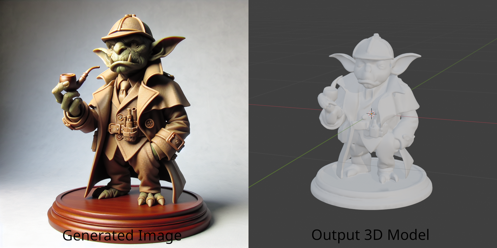

# minAIfig

Generate D&D miniatures using Trellis.

## Example

**Prompt**: A goblin detective in a trench coat holding a pipe

<details>
  <summary>Command</summary>

  ```bash
  python minaifig.py --output "assets/goblin.stl" --output-image "assets/goblin.png" --prompt "A goblin detective in a trench coat holding a pipe" --space http://localhost:7860/
  ```
</details>

[3D Model](assets/goblin.stl)


## How it works

This script generates images using DALL-E, sends the image to [TRELLIS](https://huggingface.co/spaces/JeffreyXiang/TRELLIS) to create a 3D model, then cleans up the model using Blender.

## Requirements

- `pip install -r requirements.txt`
- (Optional) An OpenAI API key: for image generation
- (Optional) Blender: to clean the mesh and convert from GLTF to other formats

## Usage

- Generate from a prompt
```bash
export OPENAPI_TOKEN="<TOKEN>"
python minaifig.py --output "elf.glb" --prompt "An elven ranger with a short sword and a dagger"
```

- Generate from a prompt and save the generated image as well
```bash
export OPENAPI_TOKEN="<TOKEN>"
python minaifig.py --output "elf.glb" --output-image "elf.png" --prompt "An elven ranger with a short sword and a dagger"
```

- Generate from an existing image
```bash
python minaifig.py --output "elf.glb" --input-image "elf.png"
```

## Running TRELLIS Locally

The easiest way to run TRELLIS locally is to run the Space as a Docker container.

```bash
docker run -it -p 7860:7860 --gpus all registry.hf.space/jeffreyxiang-trellis:latest python app.py
```

Then pass `--space http://localhost:7860` to the script.
